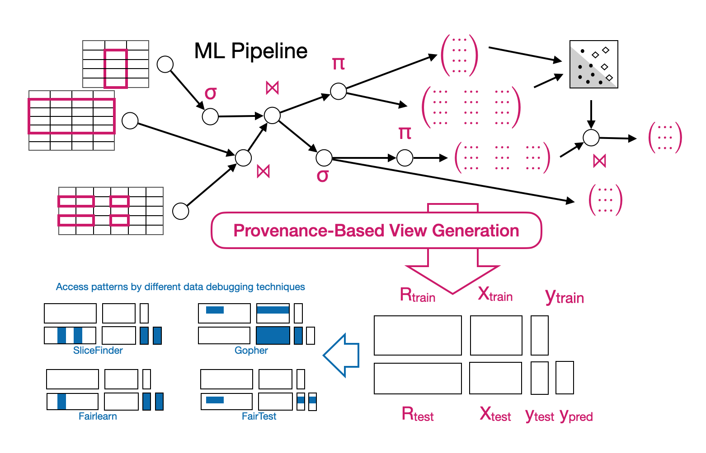

## freamon

__Freamon__ enables data scientists to automatically reconstruct and query the intermediate data from ML pipelines to reduce the level of expertise and manual effort required to debug this data.

  

We provide an [example notebook](view-reviews.ipynb) that shows how to capture and query the intermediates of a [complex ML pipeline with four different input sources](classify_amazon_reviews_sklearn.py). Freamon instruments the pipeline and tracks its provenance via an [optimized variant of mlinspect](https://github.com/stefan-grafberger/mlinspect/tree/lineage-opt), and subsequently reconstructs the intermediates based on the provenance.

This project is work in progress, and we already have a preliminary implementation for [pyspark pipelines](preliminary-views-for-pyspark.ipynb) as well. 

We include example pipelines and datasets from the [OpenML](https://www.openml.org) project, the [dspipes](https://github.com/DS3Lab/datascope-pipelines) project of the [DS3Lab](https://github.com/DS3Lab) and from the [arguseyes](https://github.com/schelterlabs/arguseyes)/[mlinspect](https://github.com/stefan-grafberger/mlinspect) projects.
